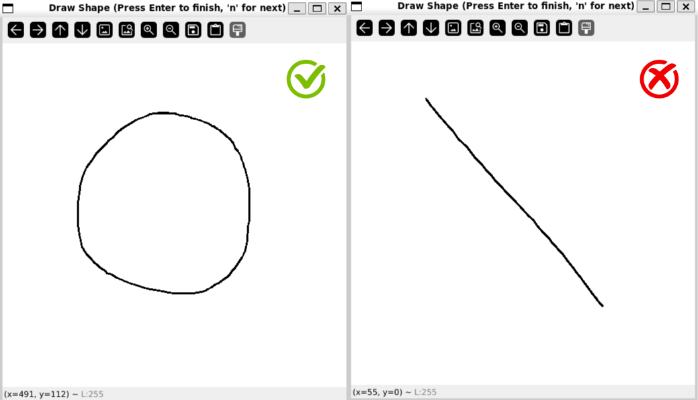

# PX4 ROS2 Workspace
This repository contains examples and all the required files to be used for controlling the drone and also to use my other repo Multi-Drone-PX4-RL. 

## Content
- Example files to launch in Gazebo with PX4 x500 Drones ( controlled with ROS2 Topics )
- px4_msgs and px4_ros_com files to be used by other repositories

## Requirements
I have tested the file and it's working with the following :
- Ubuntu 24.04 Noble
- ROS2 Jazzy
- Gazebo Harmonic v8.9.0
> You can try to test other versions of Ubuntu, ROS2 and Gazebo, But I am not sure of it's working.

## How to use 
Copy this repo to your device and then install the following before continuing
```
git clone https://github.com/DevashishHarsh/px4_ros2_ws.git --recursive
```

## Installation for PX4-Autopilot
This installation follows the latest PX4-Autopilot from this website [PX4 Installation Guide](https://docs.px4.io/main/en/dev_setup/building_px4).
> Make sure to use "git checkout 38d67f5" as I have only worked with that specific release and it works for me.

## Installation for ROS2
You can follow the official ROS2 guide for installing it on your linux system using [ROS2 Installation Guide](https://docs.ros.org/en/jazzy/Installation.html).
After installing ROS2, Add the source file to .bashrc so that you don't need to source it everytime you open a new terminal
```
echo 'source /opt/ros/jazzy/setup.bash' >> ~/.bashrc
```

## Installation for Micro XRCE-DDS
Use the following commands to install Micro XRCE-DDS as it is required to create ROS2 Topics for PX4 Autopilot drones ( previously mavros was used )
```
git clone -b v2.4.2 https://github.com/eProsima/Micro-XRCE-DDS-Agent.git
cd Micro-XRCE-DDS-Agent
mkdir build
cd build
cmake ..
make
sudo make install
sudo ldconfig /usr/local/lib/
```
> If you get fastdds version error, refer to this for [solution](https://github.com/PX4/PX4-Autopilot/issues/24477).
> For more documentation of MicroXRCE-DDS with PX4-Autopilot, refer to [documentation](https://docs.px4.io/main/en/middleware/uxrce_dds.html#starting-the-agent).

## Install QGroundControl
QGroundControl gives ground control data for PX4 Drones as it is required to run the example scripts.
```
wget https://d176tv9ibo4jno.cloudfront.net/latest/QGroundControl-x86_64.AppImage
chmod +x QGroundControl-x86_64.AppImage
```
>  For more documentation of QGroundControl with PX4-Autopilot, refer to [documentation](https://docs.px4.io/main/en/getting_started/px4_basic_concepts.html#qgc)

## Running the Examples
1. Make sure everything is set up properly and running properly.
2. Run PX4 Autopilot with x500 drone in Gazebo.
```
make px4_sitl gz_x500
```
3. Run QGroundControl ( in the same directory as the file )
```
./QGroundControl-x86_64.AppImage
```
4. Run MicroXRCE-DDS Agent ( can be executed anywhere )
```
MicroXRCEAgent udp4 -p 8888
```
5. Build the workspace and source it.
```
cd ~/px4_ros2_ws
colcon build
source install/setup.bash
```
> This will build the drone control module along with the submodules "px4_msgs" and "px4_ros_com"
6. Use the command to run the desired example
```
ros2 run drone_control <example_name>
```
## Drone Examples
- drone_formation : Moves the spawned drones to the create the formation.
- drone_formation_change : Moves the spawned drones to create the formation along with control and formation changes using "n" key.
- drone_formation_control : Moves the spawned drones to create the formation along with control
- drone_manual : Allows manual control of the drone with keyboard.
- drone_select : Allows manual control of the drones with selecting each one of them.
  
### Formation requirements
Some of the examples require formation points for the drones to actually move in 3D space, as visualized by Gazebo. You can access by running [draw.py](drone_control/drone_control/points/draw.py)
#### Usage 
- Run draw.py
```
python3 ~/px4_ros2_ws/drone_control/drone_control/points/draw.py
```
This will let you draw your shape and let you save it with pressing "Enter" and if you want more shapes to be saved, press "n" to save multiple formations which you can access in the code with "n".
> You will be prompted to enter the number of drones. Keep the number upto 10 as more drones takes a lot of memory space.
- Note : Make sure the drawings you make are closed shapes as I have yet to figure out how to distribute them over open shapes.


## License
This repository is provided under the MIT License.


